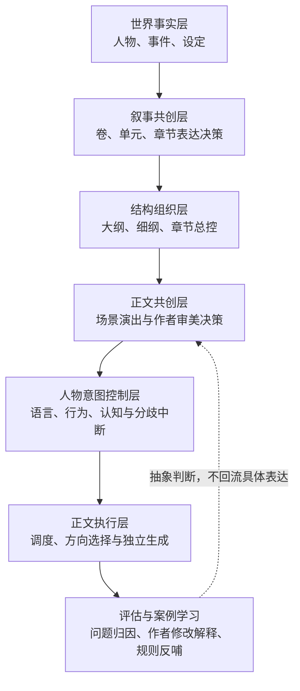

# 设计流程与方案总索引

> [!abstract] 索引定位
> 本页是“设计流程与方案”目录的统一入口，供作者、开发者和模型查阅系统架构、当前方案、实施记录与历史版本。阅读或修改系统前，优先从本页确定权威文档和所属层级，不要仅凭文件名选择资料。

## 一、快速入口

|目标|首选文档|说明|
|---|---|---|
|理解当前系统总架构|[[设计流程与方案/小说写作系统架构需求文档 V1.3|小说写作系统架构需求文档 V1.3]]|当前架构入口；定义事实层、共创层、结构层、人物意图层和正文执行层|
|了解早期系统落地与模板建设进度|[[设计流程与方案/小说写作系统 V1.2 设计稿|小说写作系统 V1.2 设计稿]]|保留资料调用、上下文包、模板和阶段进度等实施背景|
|查看 Obsidian、YAML、命名和目录规范|[[设计流程与方案/文档obsidian字段设定 V1.0|文档 Obsidian 字段设定 V1.0]]|文档工程规范；当前文件名与文内主标题版本不一致，使用前需注意|
|理解总—分—总正文生成架构|[[设计流程与方案/共创机制/导演式正文生成Skill改造方案实施稿|导演式正文生成 Skill 改造方案实施稿]]|正文生成改造的实施入口与断点记录|
|查模板之间的职责和输入输出边界|[[设计流程与方案/共创机制/模板接口规范_总分总正文生成链路|模板接口规范：总分总正文生成链路]]|模板与产物接口的优先查阅文档|
|理解作者如何介入正文创作|[[设计流程与方案/共创机制/共创机制思考|共创机制思考]]|正文共创与场景演出设计的理论来源|
|设计草稿到正文的作者审美链|[[设计流程与方案/共创机制/作者审美解释与盲写正文链路 V0.1|作者审美解释与盲写正文链路 V0.1]]|已进入持续开发；包含案例学习、审美诊断、方向裁决和参照隔离生成|
|继续当前作者审美校准工作|[[设计流程与方案/共创机制/CURRENT_作者审美链工作状态|作者审美链当前工作状态]]|跨对话续接入口；只读取最小资料即可继续当前阶段|
|查阅正式作者审美判断|[[System_alpha/04_Skill系统/03_正文生成/作者审美决策库/LIB-AESTHETIC-P0_作者审美决策库|P0 作者审美决策库]]|A1—A8 已获作者确认并正式入库|
|实施人物意图控制|[[设计流程与方案/意图控制器/实施/意图控制系统实施总览|意图控制系统实施总览]]|意图控制器开发入口、阶段状态与任务顺序|
|确认意图控制文档是否一致|[[设计流程与方案/意图控制器/实施/文档对齐检查报告|文档对齐检查报告]]|检查职责、交互、状态和实施缺口|

## 二、当前系统架构图



架构解释以 [[设计流程与方案/小说写作系统架构需求文档 V1.3#5. V1.3 新系统分层|V1.3 新系统分层]] 为准。正文侧的最新增量是：作者修改案例只能回流为带适用边界的审美判断，作者原句、成品桥段和具体表达不得进入正文模型。

## 三、总架构与版本演进

### 3.1 当前架构

#### [[设计流程与方案/小说写作系统架构需求文档 V1.3|小说写作系统架构需求文档 V1.3]]

- 定位：当前总架构入口。
- 重点：世界事实不艺术加工；共创机制负责叙事表达决策；正文采用总—分—总导演式生成。
- 解决：自动推断作者表达、执行包信息过满、人物意图与作者表现意图混淆、先生成再修等矛盾。
- 阅读建议：先读版本定位、架构总原则、新系统分层和完整流程，再进入具体子系统。

### 3.2 实施背景与阶段资料

#### [[设计流程与方案/小说写作系统 V1.2 设计稿|小说写作系统 V1.2 设计稿]]

- 定位：V1.2 阶段的详细设计与进度记录。
- 重点：资料调用、单元上下文包、正式模板、LLM 调用摘要和模板验证。
- 使用边界：当其总体架构与 V1.3 冲突时，以 V1.3 为准；模板建设背景仍可参考。

#### [[设计流程与方案/小说写作系统架构需求文档 V1.1|小说写作系统架构需求文档 V1.1]]

- 定位：V1.0 到 V1.2 之间的架构扩展版本。
- 重点：模块边界、Obsidian 索引简洁原则、资料调用和写作生成 Skill。
- 使用边界：历史基线，不作为当前共创和正文生成机制的最终依据。

#### [[设计流程与方案/小说写作系统架构需求文档 V1.0|小说写作系统架构需求文档 V1.0]]

- 定位：系统最初架构基线。
- 重点：叙事系统、设定系统、事件数据库、Skill 系统以及四大系统边界。
- 使用边界：用于追溯原始设计原则，不覆盖后续版本。

### 3.3 文档工程规范

#### [[设计流程与方案/文档obsidian字段设定 V1.0|文档 Obsidian 字段设定 V1.0]]

- 定位：目录、YAML、命名、编号、关系字段和各系统文件结构规范。
- 适用：创建或调整系统正式文档、模板、人物卡、事件卡、章节文件时。
- 已知问题：文件名为 V1.0，文内主标题为“小说写作系统架构需求文档 V1.1”；在专门校准前，本索引按文件名引用，不据此推断其架构权威级别。

## 四、共创机制与正文生成

### 4.1 当前实施入口

#### [[设计流程与方案/共创机制/导演式正文生成Skill改造方案实施稿|导演式正文生成 Skill 改造方案实施稿]]

- 定位：导演式正文生成的当前实施记录与跨窗口续接入口。
- 核心：章节创作总控规划、非线性分工、各产物职责、最终总导演生成和 Token 控制。
- 适用：继续校准测试 Skill、正式模板和总—分—总接口时。
- 冲突处理：总体分层服从 V1.3；具体接口优先同时核对下方模板接口规范。

#### [[设计流程与方案/共创机制/模板接口规范_总分总正文生成链路|模板接口规范：总分总正文生成链路]]

- 定位：正文链路模板和产物之间的接口规范。
- 核心字段：模板职责、必须读取、只可引用、禁止复述、输出给、冲突处理、ASK_USER 触发、Token 边界。
- 适用：新增模板、修改 Skill 输入契约、判断资料是否越权或重复时。

### 4.2 共创理论来源

#### [[设计流程与方案/共创机制/共创机制思考|共创机制思考]]

- 定位：为什么正文生成前需要正式共创阶段的思考稿。
- 核心：大纲与正文之间缺少演出设计；作者应在章节启动、重点场景和正文片段后分级介入；ASK_USER 不能替代共同创作。
- 适用：理解系统为什么从自动生成转向作者—模型协同。

### 4.3 作者审美与草稿到正文

#### [[设计流程与方案/共创机制/作者审美解释与盲写正文链路 V0.1|作者审美解释与盲写正文链路 V0.1]]

- 状态：`active_development`。
- 定位：草稿到正文最后一公里的当前提案。
- 链路：生成前作者协同 → 作者修改案例解释 → 审美决策库 → 当前场景诊断 → 多方向提出 → 审美裁决 → 参照隔离生成 → 门禁检查。
- 核心边界：审美库保存判断而不保存解法；正文模型不能看到原始作者范文、作者原句或案例成品方案。
- 下一步：先用第一、二章材料形成少量待确认案例，再决定 Skill 接口改造。

当前执行状态与正式成果：

- [[设计流程与方案/共创机制/CURRENT_作者审美链工作状态|作者审美链当前工作状态]]：新对话续接和下一步唯一任务入口。
- [[System_alpha/04_Skill系统/03_正文生成/作者审美决策库/LIB-AESTHETIC-P0_作者审美决策库|P0 作者审美决策库]]：保存作者确认后的正式抽象判断。
- [[System_alpha/04_Skill系统/03_正文生成/作者审美决策库/README_作者审美决策库|作者审美决策库运行说明]]：长期迭代、版本和隔离规则。

配套模板：

- [[设计流程与方案/共创机制/TPL-AESTHETIC-CASE_作者修改案例解释模板|作者修改案例解释模板]]：把作者修改解释为拒绝倾向、叙事层面、受保护价值、适用边界和竞争解释。
- [[设计流程与方案/共创机制/TPL-AESTHETIC-LIBRARY_作者审美决策库模板|作者审美决策库模板]]：管理 L1 单案例假设、L2 重复倾向、L3 作者确认原则及同质化风险。

## 五、意图控制器

### 5.1 实施与一致性

#### [[设计流程与方案/意图控制器/实施/意图控制系统实施总览|意图控制系统实施总览]]

- 定位：意图控制器正式开发入口。
- 内容：已完成工作、未完成工作、开发顺序、文档索引、任务清单和风险提醒。
- 推荐：实施任何意图控制改造前先读本文件，再按其索引进入具体方案。

#### [[设计流程与方案/意图控制器/实施/文档对齐检查报告|文档对齐检查报告]]

- 定位：意图控制相关文档的一致性审计。
- 内容：系统中心、控制层级、交互方式、状态保存、作者权限、人物卡边界和开发前缺口。

### 5.2 核心需求与技术设计

#### [[设计流程与方案/意图控制器/方案/意图控制系统第一版需求设计|意图控制系统第一版需求设计]]

- 定位：意图控制总需求。
- 核心：整章交付、人物作为意图主体、动态对齐、风险触发、人物意图轨道、分歧分级和恢复协议。

#### [[设计流程与方案/意图控制器/方案/人物意图控制Skill第一版需求|人物意图控制 Skill 第一版需求]]

- 定位：独立人物意图控制能力的第一版需求。
- 核心：语言意图优先、行为意图其次、CONTINUE / ASK_USER / RESUME 输出和强制中断条件。

#### [[设计流程与方案/意图控制器/方案/独立意图控制Skill设计稿|独立意图控制 Skill 设计稿]]

- 定位：从需求进入 Skill 文件结构与工作流的技术设计。
- 核心：SKILL.md、输入契约、意图轨道模板、中断协议、运行态和质量检查。

#### [[设计流程与方案/意图控制器/方案/章节运行态模板|章节运行态模板]]

- 定位：保存正文生成断点、已确认规则、待确认分歧和恢复信息的状态模板。
- 使用边界：只记录运行所需状态，不替代章节共创产物或人物卡。

### 5.3 接入方案

#### [[设计流程与方案/意图控制器/方案/大纲细纲意图控制接入改造方案|大纲／细纲意图控制接入改造方案]]

- 定位：将人物意图风险逐级接入单元大纲、章节大纲、细纲、执行包和正文生成。
- 重点：上游只提供意图风险和边界，不提前写死人物的正文表现。

#### [[设计流程与方案/意图控制器/方案/正文生成Skill改造点|正文生成 Skill 改造点]]

- 定位：正文生成 Skill 接入人物意图控制的具体改造清单。
- 重点：生成前检查、关键片段、暂停恢复、对白与行为检查、草稿后意图修订。

#### [[设计流程与方案/意图控制器/方案/动态对齐方案v1.0|动态对齐方案 V1.0]]

- 定位：条件中断、分歧分级与恢复机制的详细方案。
- 重点：什么时候必须提问、什么时候禁止提问，以及纯 Skill、结构化状态和 GUI 三种实现层级。

### 5.4 讨论与思路来源

- [[设计流程与方案/意图控制器/思路/人物意图控制|人物意图控制]]：语言意图、行为因果链、人物驱动检查和优先级的理论来源。
- [[设计流程与方案/意图控制器/方案/意图控制器 讨论文本 第一次|意图控制器讨论文本第一次]]：整章生成可暂停、增量对齐和 Token 策略的讨论记录。

### 5.5 测试入口

- [[设计流程与方案/意图控制器/测试情况/测试skill地址|测试 Skill 地址]]：当前为空白占位文件，不能作为有效测试索引。后续建立真实测试目录或地址后应补齐。

## 六、推荐阅读路径

### 6.1 新用户理解系统

```text
本索引
→ 小说写作系统架构需求文档 V1.3
→ 小说写作系统 V1.2 设计稿
→ 共创机制思考
→ 导演式正文生成 Skill 改造方案实施稿
→ 意图控制系统实施总览
```

### 6.2 修改正文生成链路

```text
V1.3 总架构
→ 导演式正文生成实施稿
→ 模板接口规范
→ 作者审美解释与盲写正文链路
→ 对应正式模板和测试 Skill
```

### 6.3 修改人物意图控制

```text
意图控制系统实施总览
→ 文档对齐检查报告
→ 意图控制系统第一版需求
→ 人物意图控制 Skill 第一版需求
→ 独立意图控制 Skill 设计稿
→ 具体接入方案
```

### 6.4 创建或修改正式系统文档

```text
文档 Obsidian 字段设定
→ V1.3 对应系统层级
→ 模板接口规范
→ System_alpha 中的正式模板或需求文档
```

## 七、模型读取与决策规则

> [!important] 给模型的路由规则
> 设计文档用于解释“为什么和如何设计”，`System_alpha` 中的正式模板、正式需求和确认产物用于实际执行。设计文档与正式系统文件冲突时，不得静默选择，必须先判断版本、状态和职责，再提出需要确认的冲突点。

模型处理任务时按以下顺序读取：

1. 先从本索引确定任务所属子系统；
2. 读取当前总架构 V1.3；
3. 读取该子系统的实施入口或当前方案；
4. 需要修改接口时再读模板接口规范；
5. 需要追溯理由时才读“思考”“讨论文本”和旧版本；
6. 实际生成或改造时，继续核对 `System_alpha` 正式文件及当前测试 Skill；
7. `proposal` 文档不得自动当成已批准规则；
8. 旧版本只用于追溯，不得覆盖新版本已明确修改的结论；
9. 空白占位文件不得视为有效资料；
10. 作者范文、原句和案例具体方案不得因索引关系进入正文模型上下文。

## 八、目录职责

```text
设计流程与方案/
├─ INDEX_设计流程与方案.md         # 本总索引
├─ 小说写作系统架构需求文档 V*.md  # 总体架构与版本演进
├─ 小说写作系统 V*.md              # 阶段设计与实施背景
├─ 文档obsidian字段设定 V*.md      # 文档工程规范
├─ 共创机制/                        # 作者共创、导演式正文、审美决策与接口规范
└─ 意图控制器/
   ├─ 思路/                         # 理论来源与问题重构
   ├─ 方案/                         # 需求、协议、模板和接入设计
   ├─ 实施/                         # 当前状态、开发入口和一致性检查
   └─ 测试情况/                     # 测试索引与验证记录
```

## 九、维护规则

新增或调整设计文档时同步维护本索引：

1. 新增子系统时，在“快速入口”和“目录职责”中增加入口；
2. 新版本替代旧版本时，明确当前权威版本和旧版本用途；
3. 方案从 `proposal` 转为确认状态时，更新状态说明和阅读路径；
4. 实施入口或断点发生变化时，更新对应子系统的首选文档；
5. 文件重命名后使用 Obsidian 链接更新机制检查全部内部链接；
6. 不在索引中复制完整方案，只保留定位、职责、状态、边界和阅读顺序；
7. 发现文件名、主标题、版本号或状态不一致时，在索引中显式标记，等待专门校准；
8. 每次较大架构迭代后检查是否存在空白占位、失效测试地址或已被新版本覆盖的入口。

## 十、当前待整理项

- [ ] 校准 `文档obsidian字段设定 V1.0.md` 的文件名、主标题和实际版本。
- [ ] 补齐 `意图控制器/测试情况/测试skill地址.md`，或将空白占位归档。
- [ ] 为缺少 frontmatter 的设计文档补充 `type`、`status`、`version`、`updated` 等基础字段。
- [ ] 在作者确认审美链方案后，将其状态从 `proposal` 调整为相应阶段状态。
- [ ] 后续建立 `System_alpha` 正式系统索引，并与本设计索引互相链接。
